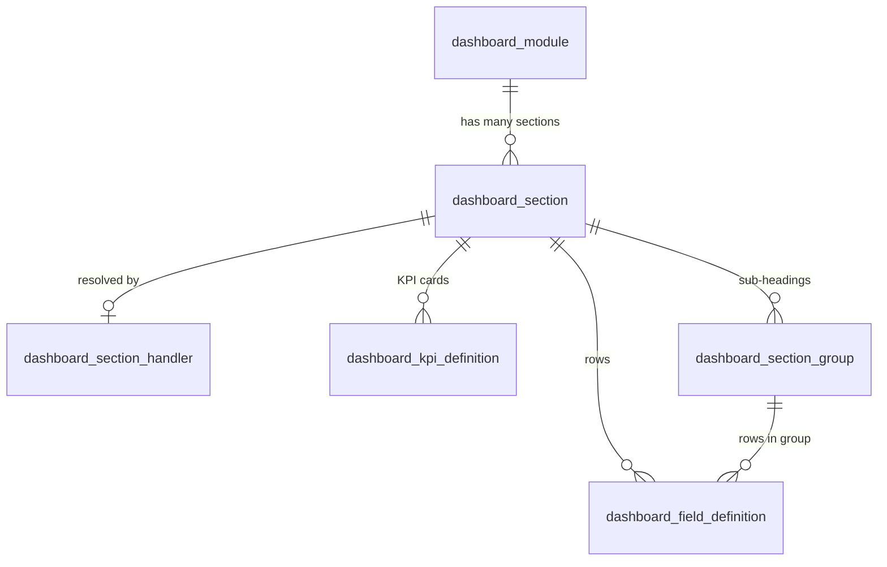

# Dashboard Section Schema

Guide for the **Investors / Investments / Assets** module dashboards (Figma accordion layout).

**Today:** section definitions live in code (`Configuration/DashboardSectionRegistry.cs`) because we cannot change the database yet.

**Later:** the same structure moves into SQL tables so sections can be added, reordered, or disabled without redeploying the API.

---

## The big picture

The dashboard has **three tabs** (modules):

| Tab | API value |
|-----|-----------|
| Investors | `investors` |
| Investments | `investments` |
| Assets | `assets` |

Each tab is built from **sections** — the KPI cards at the top, the expandable accordions, and the data tables at the bottom.

We split the problem into two parts on purpose:

```
┌─────────────────────────────────────────────────────────────────┐
│  1. SECTION CATALOG  (lightweight — "what exists on the page?") │
│     → titles, order, layout type, where to fetch data           │
│     → fetched once when user opens the tab                      │
└─────────────────────────────────────────────────────────────────┘
                              │
                              ▼  user expands a section (or page loads KPIs)
┌─────────────────────────────────────────────────────────────────┐
│  2. SECTION DATA  (heavy — actual numbers and rows)             │
│     → only fetched when needed                                  │
└─────────────────────────────────────────────────────────────────┘
```

**Why split them?** If we returned everything in one response, opening the Investors tab would run every SQL query (analytics, capital summary, full investor list, all transactions, etc.) even when the user never expands those accordions.

---

## Section types (layouts)

Each section has a `layout` that tells Angular **how to render** it.

| Layout | What it looks like (Figma) | Example section | Where data comes from |
|--------|---------------------------|-----------------|----------------------|
| `kpiRow` | Top row of 6 summary cards | Total Investors, Total Commitments, Current NAV | `GET /api/dashboard/sections/{id}` |
| `fields` | Accordion with label → value rows | Capital Account Summary | `GET /api/dashboard/sections/{id}` |
| `groupedFields` | Accordion with sub-headings and rows | Investor Analytics (By Type, By Geography, Concentration) | `GET /api/dashboard/sections/{id}` |
| `table` | Full data grid with paging | Investor List, Transactions | `dataRoute` in catalog (separate list API) |

### Load strategy

| Value | When Angular should fetch |
|-------|---------------------------|
| `eager` | Immediately when the tab opens (only used for KPI row) |
| `lazy` | When the user expands the accordion (or when a table section becomes visible) |

---

## API endpoints

### 1. Get section catalog (metadata only)

```
GET /api/dashboard/modules/investors/sections
```

Returns an ordered list of sections. **No metrics, no table rows.**

Example response (one item):

```json
{
  "id": "investors-capital-account-summary",
  "module": "investors",
  "title": "Capital Account Summary",
  "subtitle": null,
  "layout": "fields",
  "loadStrategy": "lazy",
  "sortOrder": 20,
  "isEnabled": true,
  "dataRoute": null
}
```

| Field | Meaning |
|-------|---------|
| `id` | Stable identifier — never changes once published |
| `title` / `subtitle` | Text shown in the accordion header |
| `layout` | How to render (see table above) |
| `loadStrategy` | `eager` or `lazy` |
| `sortOrder` | Display order on the page (lower = higher) |
| `dataRoute` | **Only for tables.** URL to fetch rows. `null` for accordions/KPIs. |

### 2. Get section data (on expand or KPI load)

```
GET /api/dashboard/sections/investors-capital-account-summary?view=ltd
```

`view` is the time toggle: `ltd`, `quarterly`, or `daily` (same as fund/investor metrics elsewhere).

**Do not call this for `layout: table` sections.** Use `dataRoute` instead.

### 3. Table data routes

| Section | `dataRoute` |
|---------|-------------|
| Investor List | `/api/CapitalInvestors` |
| Investors Transactions | `/api/dashboard/modules/investors/transactions` |
| Investment List | `/api/Funds` |
| Asset List | `/api/Assets` |

---

## Frontend flow (Investors tab)

```
User clicks "Investors" tab
        │
        ├─► GET /api/dashboard/modules/investors/sections
        │       └── Build page shell: KPI area + accordion headers + table placeholders
        │
        ├─► For each section where loadStrategy = "eager":
        │       GET /api/dashboard/sections/investors-kpi-summary?view=ltd
        │       └── Render 6 KPI cards
        │
        ├─► User expands "Capital Account Summary"
        │       GET /api/dashboard/sections/investors-capital-account-summary?view=ltd
        │       └── Render label/value rows
        │
        ├─► User expands "Investor List"
        │       GET /api/CapitalInvestors?page=1&pageSize=50
        │       └── Render table (uses dataRoute from catalog)
        │
        └─► User expands "Transactions"
                GET /api/dashboard/modules/investors/transactions?view=ltd&page=1
                └── Render transactions table
```

---

## Section data shapes

All field values use the same `formatType` system as the rest of the portal (`money`, `percent`, `integer`, `text`, etc.).

### KPI row (`layout: kpiRow`)

```json
{
  "sectionId": "investors-kpi-summary",
  "layout": "kpiRow",
  "view": "ltd",
  "kpis": [
    {
      "key": "totalInvestors",
      "label": "Total Investors",
      "value": 161,
      "formatType": "integer",
      "caption": "Active LPs"
    }
  ]
}
```

### Flat fields (`layout: fields`)

Used for sections like **Capital Account Summary** — a simple list of rows.

```json
{
  "sectionId": "investors-capital-account-summary",
  "layout": "fields",
  "fields": [
    { "key": "totalCapitalRaisedLtd", "value": 5840000000, "formatType": "money" },
    { "key": "uncalledCapital", "value": 1220000000, "formatType": "money" }
  ]
}
```

### Grouped fields (`layout: groupedFields`)

Used for **Investor Analytics & Benchmarking** — multiple sub-sections inside one accordion.

```json
{
  "sectionId": "investors-analytics-benchmarking",
  "layout": "groupedFields",
  "groups": [
    {
      "title": "By Investor Type",
      "fields": [
        { "key": "PensionFund", "value": 62.0, "formatType": "percent" }
      ]
    },
    {
      "title": "By Geography",
      "fields": [
        { "key": "Canada", "value": 78.0, "formatType": "percent" }
      ]
    }
  ]
}
```

---

## All sections today (Investors module)

| Order | Section ID | Title | Layout | When to fetch data |
|------:|------------|-------|--------|-------------------|
| 0 | `investors-kpi-summary` | Summary | kpiRow | On tab load |
| 10 | `investors-analytics-benchmarking` | Investor Analytics & Benchmarking | groupedFields | On expand |
| 20 | `investors-capital-account-summary` | Capital Account Summary | fields | On expand |
| 30 | `investors-risk-compliance` | Risk & Compliance | fields | On expand |
| 40 | `investors-reporting-communications` | Reporting & Communications | fields | On expand |
| 50 | `investors-portal-access` | Investor Portal Access | fields | On expand |
| 60 | `investors-list` | Investor List | table | `/api/CapitalInvestors` |
| 70 | `investors-transactions` | Transactions | table | `/api/dashboard/modules/investors/transactions` |

Investments and Assets modules follow the same pattern (see `DashboardSectionRegistry.cs`).

---

# Proposed database tables (for client review)

This section describes the SQL tables we plan to add **when DB changes are allowed**. The API contract above stays the same — only the source of the catalog moves from code to database.

## What problem do the tables solve?

| Without DB | With DB |
|------------|---------|
| Add a section → change C# code + deploy | Add a row in `dashboard_section` |
| Hide a section → code change | Set `is_enabled = 0` |
| Reorder sections → code change | Update `sort_order` |
| Rename accordion title → code change | Update `title` column |

**Important:** Warehouse numbers (commitments, NAV, etc.) are still computed by the API from Fabric tables. The dashboard tables store **configuration** (what to show and how), not the metric values themselves.

---

## Table overview

```
dashboard_module          ← the 3 tabs (Investors, Investments, Assets)
    │
    └── dashboard_section     ← each accordion / KPI row / table on that tab
            │
            ├── dashboard_kpi_definition       ← optional: KPI card labels (KPI row only)
            ├── dashboard_section_group        ← optional: sub-headings (groupedFields only)
            ├── dashboard_field_definition     ← optional: static field labels
            └── dashboard_section_handler      ← links to API code that runs SQL
```

### Two ways a section gets its data

| Approach | Best for | How it works |
|----------|----------|--------------|
| **Handler** (`handler_key`) | Analytics, KPIs, anything calculated from warehouse | API runs SQL in `DashboardService` when section is requested |
| **Field definitions** (`dashboard_field_definition`) | Risk & Compliance, Portal Access — mostly labels until metrics exist | API reads field rows from DB and fills values from `static_value` or `metric_ref` |

Most sections today use **handlers**. Field definitions are for sections that will eventually be fully config-driven.

---

## Table 1: `dashboard_module`

**Question it answers:** *What are the top-level tabs?*

| Column | Example | Purpose |
|--------|---------|---------|
| `module_id` | `1` | Internal ID |
| `module_code` | `investors` | API value (stable, used in URLs) |
| `display_name` | `Investors` | Label on the tab |
| `sort_order` | `1` | Tab order left-to-right |
| `is_enabled` | `1` | Turn tab on/off |

**Seed data (3 rows):**

| module_code | display_name | sort_order |
|-------------|--------------|------------|
| investors | Investors | 1 |
| investments | Investments | 2 |
| assets | Assets | 3 |

---

## Table 2: `dashboard_section` (core table)

**Question it answers:** *What sections appear on each tab, in what order, and how should the UI treat them?*

This is the database version of `DashboardSectionRegistry.cs`.

| Column | Example | Purpose |
|--------|---------|---------|
| `section_id` | `5` | Internal ID |
| `section_code` | `investors-capital-account-summary` | API slug (matches `id` in catalog response) |
| `module_id` | `1` | FK → `dashboard_module` (which tab) |
| `title` | `Capital Account Summary` | Accordion header |
| `subtitle` | `null` | Optional subtitle under title |
| `layout` | `fields` | `kpiRow`, `fields`, `groupedFields`, or `table` |
| `load_strategy` | `lazy` | `eager` or `lazy` |
| `sort_order` | `20` | Position on the page |
| `data_route` | `/api/CapitalInvestors` | For `table` layout only |
| `handler_key` | `investors_capital_account` | Which API code block runs the SQL |
| `is_enabled` | `1` | Show/hide without deleting |

**Example rows (Investors module):**

| section_code | title | layout | load_strategy | sort_order | data_route | handler_key |
|--------------|-------|--------|---------------|------------|------------|-------------|
| investors-kpi-summary | Summary | kpiRow | eager | 0 | null | investors_kpi_summary |
| investors-analytics-benchmarking | Investor Analytics & Benchmarking | groupedFields | lazy | 10 | null | investors_analytics |
| investors-capital-account-summary | Capital Account Summary | fields | lazy | 20 | null | investors_capital_account |
| investors-list | Investor List | table | lazy | 60 | /api/CapitalInvestors | null |
| investors-transactions | Transactions | table | lazy | 70 | /api/dashboard/modules/investors/transactions | null |

**Rules:**
- `data_route` is set when `layout = table` (frontend calls that URL for rows).
- `handler_key` is set when `layout` is `kpiRow`, `fields`, or `groupedFields` (API computes data on demand).
- A section uses **either** `data_route` **or** `handler_key`, not both.

---

## Table 3: `dashboard_section_handler` (optional lookup)

**Question it answers:** *What does each handler_key mean, and can we cache it?*

| Column | Example | Purpose |
|--------|---------|---------|
| `handler_key` | `investors_analytics` | Primary key — matches `dashboard_section.handler_key` |
| `description` | `Investor type and geography breakdown` | Human-readable note |
| `supports_view` | `1` | Does `view=ltd/quarterly/daily` change the SQL? |
| `cache_seconds` | `300` | Optional cache TTL |

This table is documentation + ops metadata. The actual SQL stays in `DashboardService` until we build a full rules engine.

---

## Table 4: `dashboard_kpi_definition` (optional)

**Question it answers:** *What KPI cards appear in the top summary row, and what are they called?*

Only used when `layout = kpiRow`. Stores **labels and display settings** — not the numbers (those come from warehouse SQL at runtime).

| Column | Example | Purpose |
|--------|---------|---------|
| `section_id` | FK to `investors-kpi-summary` section | Which KPI row |
| `kpi_key` | `totalInvestors` | API key in response |
| `label` | `Total Investors` | Card title |
| `caption` | `Active LPs` | Small text under the value |
| `format_type` | `integer` | How to format the value |
| `metric_ref` | `warehouse.investor_count` | Which warehouse metric to query |
| `sort_order` | `1` | Card order left-to-right |

**Example rows:**

| kpi_key | label | caption | format_type |
|---------|-------|---------|-------------|
| totalInvestors | Total Investors | Active LPs | integer |
| totalCommitments | Total Commitments | Cumulative | money |
| currentNav | Current NAV | Portfolio Value | money |

---

## Table 5: `dashboard_section_group` (optional)

**Question it answers:** *What are the sub-headings inside a grouped accordion?*

Only used when `layout = groupedFields` (e.g. "By Investor Type", "By Geography", "Concentration").

| Column | Example | Purpose |
|--------|---------|---------|
| `section_id` | FK to analytics section | Parent accordion |
| `group_code` | `by_investor_type` | Stable key |
| `title` | `By Investor Type` | Sub-heading text |
| `sort_order` | `1` | Order within the accordion |

For **computed** analytics (like today), groups can be returned directly from the handler SQL without DB rows. This table is for when groups/labels should be editable without code changes.

---

## Table 6: `dashboard_field_definition` (optional)

**Question it answers:** *What label/value rows appear in a section, and where does each value come from?*

Used for **config-driven** sections (Risk & Compliance, Portal Access) where fields are mostly static labels today.

| Column | Example | Purpose |
|--------|---------|---------|
| `section_id` | FK to section | Which accordion |
| `group_id` | FK or `null` | `null` = top-level field; set for grouped layouts |
| `field_key` | `amlStatus` | API key |
| `label` | `AML Review Status` | Row label shown in UI |
| `format_type` | `status` | Display format |
| `source_type` | `static` / `metric_ref` / `sql` | Where the value comes from |
| `static_value` | `"Compliant"` | Value when `source_type = static` |
| `metric_ref` | `risk.aml_status` | Warehouse metric when `source_type = metric_ref` |
| `sort_order` | `1` | Row order |

**Example (static placeholder until warehouse has risk data):**

| field_key | label | source_type | static_value |
|-----------|-------|-------------|--------------|
| amlStatus | AML Review Status | static | Pending configuration |
| kycCompletion | KYC Completion | static | Pending configuration |

---

## Relationship diagram



---

## Minimum viable DB (start here)

If you want the smallest useful schema first, create only:

1. **`dashboard_module`** — 3 tab rows
2. **`dashboard_section`** — one row per accordion/KPI/table

That alone replaces `DashboardSectionRegistry.cs`. Add the optional tables later when you need admin UI for KPI labels, static fields, or group titles.

---

## Migration plan (code → database)

| Step | Action |
|------|--------|
| 1 | Create `dashboard_module` + `dashboard_section` |
| 2 | Seed rows from current `DashboardSectionRegistry.cs` |
| 3 | API reads catalog from DB; fall back to code registry if DB is empty |
| 4 | Add optional tables as admin features are needed |
| 5 | Remove code registry once DB is the source of truth |

---

## Code locations (current implementation)

| What | File |
|------|------|
| Tab enum | `Entities/DashboardModule.cs` |
| Section ID enum | `Entities/DashboardSectionId.cs` |
| API response models | `Entities/DashboardSection.cs` |
| In-memory catalog (temporary) | `Configuration/DashboardSectionRegistry.cs` |
| SQL + section data logic | `Services/DashboardService.cs`, `Services/DashboardService.Investors.cs` |
| HTTP endpoints | `Controllers/DashboardController.cs` |
